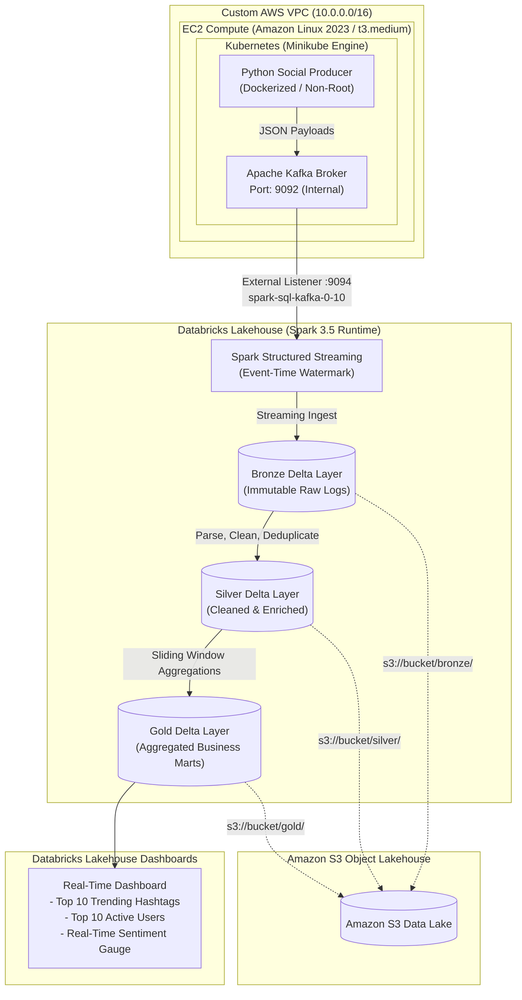

# Real-Time Social Media Intelligence Platform
### *Enterprise Cloud-Native Streaming Lakehouse on AWS, Kubernetes, Kafka, Databricks & Delta Lake*

[](https://aws.amazon.com/)
[](https://kubernetes.io/)
[](https://www.docker.com/)
[](https://kafka.apache.org/)
[](https://www.databricks.com/)
[](https://spark.apache.org/)
[](https://delta.io/)
[](https://www.python.org/)

---

## 1. Executive Summary & Business Problem

Organizations receive millions of continuous customer interactions, brand mentions, and product discussions across social media every day. Traditional batch ELT pipelines process data hours or days after events occur, rendering marketing and customer support teams reactive rather than proactive.

This project delivers an **end-to-end, production-grade streaming data lakehouse** capable of ingesting high-velocity social media posts, executing sub-second distributed transformations, and persisting business metrics into a **Medallion Data Lake on Amazon S3** with live SQL visualizations on **Databricks Dashboards**.

---

## 2. End-to-End System Architecture



---

## 3. Technology Stack & Architectural Justifications

| Layer | Technology | Why Chosen? (Engineering Justification) |
| :--- | :--- | :--- |
| **Cloud & Networking** | AWS (VPC, IGW, Route Tables, Security Groups) | Custom `/16` CIDR isolation prevents corporate network overlap; stateful Security Groups enforce strict least-privilege ingress; IAM instance profiles eliminate static hardcoded credentials. |
| **Compute & Host** | EC2 + Amazon Linux 2023 + Swap Memory | Configured 2GB swap partition to prevent Linux kernel OOM (Out-of-Memory) kills when running Minikube + Kafka JVM under streaming load. |
| **Containerization** | Docker (Multi-Stage) | Reduced image size from 600MB+ to 110MB; runs under dedicated non-root UID (`10001`) to comply with CIS Kubernetes security benchmarks. |
| **Orchestration** | Kubernetes (Minikube) | Self-healing deployments, rolling updates, and declarative ConfigMaps decouple runtime parameters from container code. |
| **Message Streaming** | Apache Kafka | Immutable distributed commit log with partition keying (`hash(hashtag) % partitions`) to guarantee per-tag in-order delivery; dual advertised listeners enable both in-cluster and external Databricks consumption. |
| **Distributed Processing** | Databricks (PySpark Structured Streaming) | Industry gold standard for horizontally scalable stream processing with event-time watermarking, micro-batch checkpointing, and exactly-once fault tolerance. |
| **Storage Architecture** | Amazon S3 + Delta Lake | Medallion architecture (Bronze/Silver/Gold); Delta ACID transaction logs eliminate the S3 partial write problem and enable file compaction via `OPTIMIZE` and `Z-ORDER BY`. |
| **Analytics & BI** | Databricks SQL Dashboards | Low-latency SQL warehouse queries reading directly from Gold Delta tables without requiring external reporting databases. |

---

## 4. Medallion Data Lake Design

```text
s3://social-media-lakehouse/
├── bronze/
│   └── social_media_raw/         <-- Append-only raw Kafka strings + ingestion timestamps
├── silver/
│   └── social_media_posts/       <-- Cleansed, schema-enforced, deduplicated, sentiment-classified
├── gold/
│   ├── trending_hashtags/        <-- 5-min sliding window: post counts, engagement, sentiment
│   └── active_users/             <-- 5-min sliding window: top publishing users & interaction reach
└── checkpoints/                  <-- Write-ahead logs (WAL) ensuring exactly-once recovery
```

---

## 5. Repository Structure

```text
social-media-intelligence-platform/
├── README.md                                          <-- System documentation & deployment guide
├── infra/
│   ├── 01_aws_infra_setup.sh                         <-- Production VPC, Subnet, SG, IAM, EC2 launch script
│   └── teardown.sh                                   <-- Clean resource disposal script
├── kubernetes/
│   ├── kafka/
│   │   ├── kafka-deployment.yaml                     <-- Kafka & Zookeeper with dual advertised listeners
│   │   ├── kafka-service.yaml                        <-- NodePort service for ports 9092 & 9094
│   │   └── kafka-setup.sh                            <-- Topic creation & partition management
│   └── producer/
│       ├── producer-configmap.yaml                   <-- Dynamic runtime configurations
│       └── producer-deployment.yaml                  <-- Non-root container with resource limits
├── producer/
│   ├── Dockerfile                                    <-- Multi-stage non-root container build
│   ├── requirements.txt
│   └── producer.py                                   <-- Resilient event stream generator with exponential backoff
├── databricks/
│   ├── 01_kafka_bronze_ingest.py                     <-- Raw Kafka streaming ingest to Bronze Delta
│   ├── 02_silver_transformations.py                  <-- Schema validation, deduplication, Silver ETL
│   └── 03_gold_aggregations.py                       <-- Event-time watermarked sliding window aggregations
├── dashboard/
│   └── queries.sql                                   <-- Databricks SQL queries powering BI visualizations
└── docs/
    ├── phase1_aws_networking_interview_guide.md      <-- AWS networking deep-dive & interview Q&As
    ├── phase2_containerization_kubernetes_interview_guide.md <-- Docker & K8s deep-dive & interview Q&As
    ├── phase3_kafka_streaming_interview_guide.md     <-- Kafka commit log, partitioning, & lag triage
    └── phase4_spark_streaming_delta_lake_interview_guide.md <-- Spark internals, watermarking, & Delta Lake
```

---

## 6. Quickstart & Deployment Guide

### Prerequisites
* AWS Account with configured credentials (`aws configure` or IAM user).
* SSH Key pair in your target region.

### Step 1: Provision AWS Infrastructure
```bash
chmod +x infra/01_aws_infra_setup.sh infra/teardown.sh
./infra/01_aws_infra_setup.sh
```

### Step 2: Deploy Streaming Pipeline on EC2
SSH into the provisioned EC2 instance:
```bash
ssh -i /path/to/key.pem ec2-user@<EC2_PUBLIC_IP>
```
Start Minikube and apply Kubernetes manifests:
```bash
minikube start --driver=docker

# Deploy Kafka Broker with Dual Listeners
kubectl apply -f kubernetes/kafka/kafka-deployment.yaml
kubectl apply -f kubernetes/kafka/kafka-service.yaml

# Configure Topic
chmod +x kubernetes/kafka/kafka-setup.sh
./kubernetes/kafka/kafka-setup.sh

# Build & Deploy Event Producer
docker build -t social-media-producer:latest ./producer
minikube image load social-media-producer:latest
kubectl apply -f kubernetes/producer/producer-configmap.yaml
kubectl apply -f kubernetes/producer/producer-deployment.yaml
```

### Step 3: Run Databricks Structured Streaming
1. Import `databricks/01_kafka_bronze_ingest.py`, `02_silver_transformations.py`, and `03_gold_aggregations.py` into your Databricks workspace.
2. In your cluster configuration, attach library: `org.apache.spark:spark-sql-kafka-0-10_2.12:3.5.0`.
3. Set Spark config or widget `pipeline.kafka.bootstrap` to `<EC2_PUBLIC_IP>:9094`.
4. Run all three streaming notebooks.

### Step 4: Open Databricks SQL Dashboard
1. Open the Databricks SQL Editor.
2. Execute the queries in `dashboard/queries.sql`.
3. Build the two bar charts: **Top 10 Trending Hashtags** and **Top 10 Most Active Users** (matching your target UI).

---

## 7. Resume Highlight (Copy-Paste Ready)

**Real-Time Social Media Intelligence Platform**  
*AWS | Apache Kafka | Docker | Kubernetes | Databricks | PySpark | Amazon S3 | Delta Lake*
* Architected and deployed an enterprise streaming data platform on AWS using Docker, Kubernetes, Apache Kafka, Databricks, and Amazon S3, processing continuous social-media event streams with sub-second latency.
* Engineered a resilient Python event producer running on Kubernetes under a non-root security context with exponential backoff and partition-key hashing to guarantee per-tag in-order delivery.
* Configured Kafka dual advertised listeners to bridge private Kubernetes pod networking with external cross-cloud Databricks Spark Structured Streaming clusters.
* Implemented an end-to-end Medallion Architecture (Bronze $\rightarrow$ Silver $\rightarrow$ Gold) using PySpark and Delta Lake on S3, applying event-time watermarking to handle out-of-order data and streaming deduplication.
* Built real-time Databricks SQL dashboards visualizing top trending hashtags, user interaction metrics, and sentiment distribution for executive decision-making.
