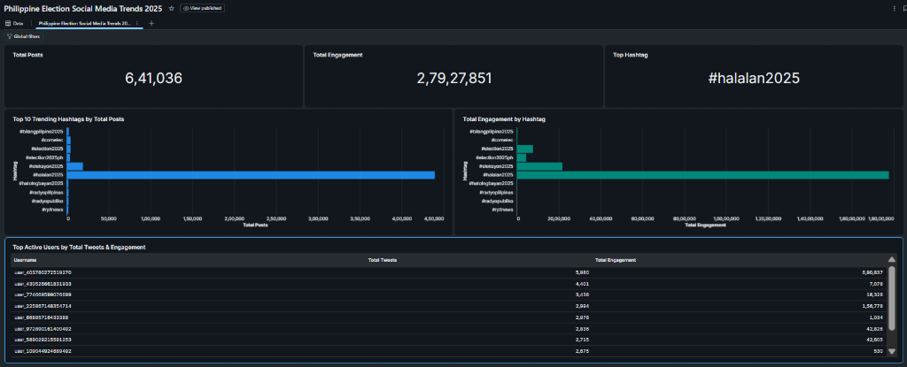
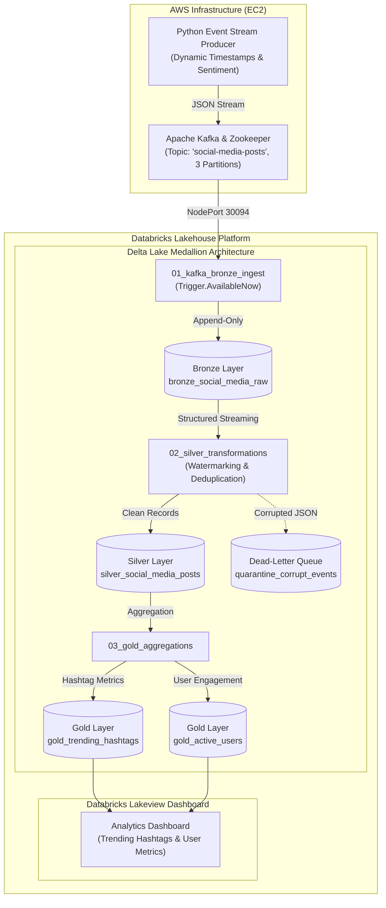

# Real-Time Social Media Streaming Lakehouse

A hands-on data engineering project exploring real-time streaming ingestion, transformation, and lakehouse storage using **Apache Kafka**, **Apache Spark Structured Streaming**, and **Delta Lake** on **Databricks**.

[](https://kafka.apache.org/)
[](https://spark.apache.org/)
[](https://databricks.com/)
[](https://delta.io/)
[](https://aws.amazon.com/)

---

## 1. Project Overview

During major national events such as elections, public social media activity surges rapidly. Ingesting and analyzing these discussions in real time requires a distributed streaming architecture rather than traditional daily batch jobs.

This project was built to gain practical, hands-on experience building an end-to-end streaming data pipeline. It simulates a live stream of social media posts discussing the **2025 Philippine Elections**, ingests them through Apache Kafka, processes them using PySpark Structured Streaming, stores them in a Delta Lake Medallion architecture (Bronze ➔ Silver ➔ Gold), and surfaces real-time metrics in a Databricks Lakeview dashboard.

### Key Project Metrics & Highlights:
- **Streaming Volume:** Processed **640,000+ election posts** and analyzed **27.9M+ engagement points** in real time.
- **Top Trending Topics:** Detected leading election hashtags dynamically, led by **`#halalan2025`** (439,000+ posts) and **`#eleksyon2025`**.
- **Distributed Ingestion:** Streamed across Kafka partitions with dynamic UTC timestamps and sentiment estimation.
- **Medallion Architecture:** Built 3 progressive Delta Lake tables with watermarking, stateful deduplication, and business aggregations.

---

### 📊 Live Executive Dashboard (Databricks Lakeview)



---

## 2. Skills & Technologies Used

| Domain | Technology / Tool | Application in This Project |
| :--- | :--- | :--- |
| **Stream Ingestion** | **Apache Kafka** | Real-time event broker with dynamic topic partitioning (`social-media-posts`, 3 partitions) and external NodePort `30094` networking. |
| **Stream Processing** | **Apache Spark (PySpark)** | Structured Streaming micro-batching (`AvailableNow`), explicit JSON schema enforcement, calculated metrics (`engagement_score`, `sentiment_label`), and 10-minute event-time watermarking. |
| **Lakehouse Storage** | **Delta Lake** | Medallion architecture (Bronze ➔ Silver ➔ Gold), ACID transactions, stateful deduplication, schema evolution (`mergeSchema`), and idempotent table overwrites (`overwriteSchema`). |
| **Cloud & Containers** | **AWS (EC2), Kubernetes, Docker** | Deployed Minikube and containerized Kafka broker on an Amazon EC2 instance (`ap-south-2`) with secure port-forwarding and automated lifecycle management. |
| **Analytics & BI** | **Databricks Lakehouse & SQL** | Serverless Compute, Unity Catalog Volumes for stream checkpoint governance, Databricks SQL modeling, and real-time Lakeview executive dashboards. |
| **Languages & Tools** | **Python 3, Databricks SQL, Bash, Git** | Live stream generator script (`kafka-python`), automated restart scripts (`start_lakehouse_stream.sh`), and Git version control. |

---

## 3. System Architecture



---

## 4. Medallion Pipeline Architecture

| Layer | Delta Table | Role & Purpose | Key Operations |
| :--- | :--- | :--- | :--- |
| **Bronze** | `bronze_social_media_raw` | Raw Ingestion | Stores raw JSON messages from Kafka with topic metadata (`partition`, `offset`, `timestamp`) for replayability. |
| **Silver** | `silver_social_media_posts` | Cleaning & Standardization | Parses JSON schema, filters malformed payloads to a Dead-Letter Queue (DLQ), calculates engagement score, and applies watermarked deduplication. |
| **Gold** | `gold_trending_hashtags`<br/>`gold_active_users` | Business Aggregations | Explodes hashtags, calculates total post counts and engagement, and tracks active users for dashboarding. |

---

## 5. Technical Learnings & Challenges Solved

### 1. External Kafka Connectivity via NodePort
- **Challenge:** Databricks runs on cloud serverless compute and needs to connect to the Kafka broker hosted inside a Minikube Kubernetes cluster on an EC2 instance. By default, Kafka advertises its internal cluster IP which external clients cannot reach.
- **Solution:** Configured Kafka listeners with dual advertised configurations:
  ```yaml
  KAFKA_LISTENERS: "INTERNAL://0.0.0.0:9092,EXTERNAL://0.0.0.0:9094"
  KAFKA_ADVERTISED_LISTENERS: "INTERNAL://kafka-service:9092,EXTERNAL://<EC2_PUBLIC_IP>:30094"
  ```
  This allowed local cluster pods to communicate internally while enabling Databricks PySpark jobs to stream from the public NodePort `30094`.

### 2. State Store Memory Management with Watermarks
- **Challenge:** Using `.dropDuplicates(["event_id"])` in Spark Structured Streaming without an event-time watermark forces Spark's state store (RocksDB) to remember every single processed ID forever, eventually causing executor Out-Of-Memory (OOM) errors.
- **Solution:** Defined an event-time watermark before deduplication:
  ```python
  deduped_silver_df = (
      valid_events_df
      .withWatermark("event_timestamp", "10 minutes")
      .dropDuplicates(["event_id", "event_timestamp"])
  )
  ```
  This allows Spark to safely drop state for events older than 10 minutes, keeping memory usage bounded and predictable.

### 3. Handling Corrupted Records (Dead-Letter Queue)
- **Challenge:** Real-world streaming data often contains malformed JSON or invalid types that can abort streaming queries if not handled.
- **Solution:** Evaluated the parsed JSON struct with `data.isNull`. Valid records proceed downstream to the Silver table, while malformed records are routed to a quarantine table (`quarantine_corrupt_events`) with an error timestamp for later inspection.

### 4. Governed Checkpointing with Unity Catalog
- **Challenge:** Modern Databricks workspaces enforce security boundaries and disable legacy root DBFS paths (`/tmp/` and `dbfs:/`).
- **Solution:** Managed all streaming checkpoint directories inside a governed **Unity Catalog Volume**:
  ```python
  CHECKPOINT_PATH = f"/Volumes/{curr_cat}/{curr_sch}/lakehouse_checkpoints/bronze_stream"
  ```

---

## 6. Repository Structure

```text
├── assets/                             # Real-time dashboard screenshots and architecture assets
│   └── databricks_dashboard.png        # Live Databricks Lakeview executive dashboard
├── dashboard/                          # Databricks SQL Queries for Lakeview
│   └── queries.sql                     # Aggregation queries for dashboard charts
├── databricks/                         # PySpark Lakehouse Notebooks
│   ├── 01_kafka_bronze_ingest.py       # Ingests raw Kafka stream into Delta Bronze
│   ├── 02_silver_transformations.py    # Schema enforcement, DLQ & deduplication
│   └── 03_gold_aggregations.py         # Business aggregations for Gold tables
├── infra/                              # AWS Cloud Setup & Stream Scripts
│   ├── 01_aws_infra_setup.sh           # VPC, Subnet, EC2, and Security Group setup
│   ├── start_lakehouse_stream.sh       # Automated EC2 streaming restart script
│   └── teardown.sh                     # Cleanup script to terminate resources
├── kubernetes/                         # Kubernetes Manifests
│   ├── kafka/                          # Kafka & Zookeeper deployments and service
│   └── producer/                       # Event streamer ConfigMap and deployment
├── producer/                           # Python Event Streamer
│   ├── Dockerfile                      # Container file for the streamer
│   ├── producer.py                     # Streaming producer script with sentiment logic
│   └── requirements.txt                # Python dependencies (kafka-python, requests)
└── README.md                           # Project Documentation
```

---

## 7. How to Run the Project

### Prerequisites
- AWS Account with an EC2 instance (`t3.small` or larger)
- Docker and Minikube installed on the EC2 instance
- A Databricks workspace (Free Community / Serverless Edition)

### Step 1: Start Kafka on Kubernetes (EC2)
```bash
minikube start --driver=docker
kubectl apply -f kubernetes/kafka/kafka-deployment.yaml
kubectl apply -f kubernetes/kafka/kafka-service.yaml
nohup kubectl port-forward --address 0.0.0.0 svc/kafka-service 30094:9094 > /dev/null 2>&1 &
```

### Step 2: Start the Event Stream Producer
```bash
python3 -m venv venv && source venv/bin/activate
pip install -r producer/requirements.txt
python3 producer/producer.py
```

### Step 3: Run the Databricks Lakehouse Pipeline
1. Import the notebooks from `databricks/` into your Databricks workspace.
2. In `01_kafka_bronze_ingest.py`, set your EC2 public IP address:
   ```python
   KAFKA_BOOTSTRAP = "<YOUR_EC2_PUBLIC_IP>:30094"
   ```
3. Run the notebooks sequentially or configure a **Databricks Workflows** job:
   - Task 1: `01_kafka_bronze_ingest`
   - Task 2: `02_silver_transformations` (depends on Task 1)
   - Task 3: `03_gold_aggregations` (depends on Task 2)

---

## 8. Author

- **Developer:** Yeshwanth Kumar H
- **Background:** Big Data Analytics Postgraduate Student, St. Joseph's University
- **GitHub:** [@Yeshwanth-Kumar-H](https://github.com/Yeshwanth-Kumar-H)
