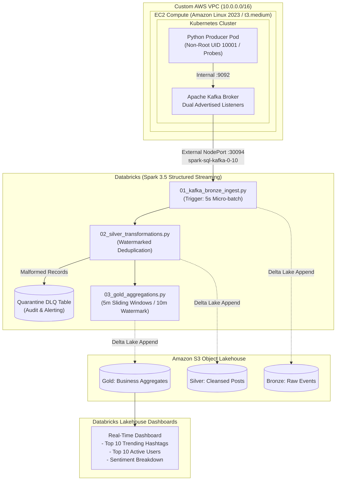

# Real-Time Social Media Intelligence Platform
### *Cloud-Native Streaming Lakehouse on AWS, Kubernetes, Kafka, Databricks & Delta Lake*

[](https://aws.amazon.com/)
[](https://kubernetes.io/)
[](https://www.docker.com/)
[](https://kafka.apache.org/)
[](https://www.databricks.com/)
[](https://spark.apache.org/)
[](https://delta.io/)
[](https://www.python.org/)

---

## 1. Project Overview & Problem Statement

Organizations require timely visibility into audience conversations, trending hashtags, and brand sentiment. Relying exclusively on batch processing introduces latency of hours or days, delaying responses to viral events or emerging sentiment spikes.

This project implements an **end-to-end streaming data lakehouse** that:
1. Ingests structured social media posts into **Apache Kafka** running inside a containerized **Kubernetes (Minikube)** environment on an AWS EC2 node.
2. Exposes external Kafka listeners to ingest streams into **Databricks Spark Structured Streaming**.
3. Transforms, enriches, and validates data across a **Medallion Architecture (Bronze ➔ Silver ➔ Gold)** on **Amazon S3** with **Delta Lake ACID transactions**.
4. Routes malformed records into a dedicated **Dead-Letter Queue (DLQ)** quarantine table for auditability.
5. Surfaces aggregated trend metrics on **Databricks SQL Dashboards**.

---

## 2. System Architecture



---

## 3. Key Technical Decisions & Mechanisms

| Component | Technical Choice | Specific Mechanism / Implementation |
| :--- | :--- | :--- |
| **Cloud Networking** | Custom AWS VPC (`10.0.0.0/16`) | Custom public subnet (`10.0.1.0/24`), custom route table with Internet Gateway. Prevents default VPC CIDR collisions and isolates data workloads. |
| **Security & IAM** | Scoped IAM Role & Instance Profile | IAM policy is explicitly scoped to `arn:aws:s3:::<bucket>` and `arn:aws:s3:::<bucket>/*`. **No managed FullAccess policies used.** |
| **Security Groups** | Stateful Ingress Rules | Inbound restricted strictly to Port 22 (SSH) and Port 30094 (Kafka External NodePort). Port 9092 is kept internal. |
| **Memory Stability** | Linux 2GB Swap Partition | Provisioned via EC2 user-data to prevent Linux kernel OOM (Out-of-Memory) Killer from terminating Minikube/Kafka processes on memory-constrained nodes. |
| **Container Security** | Multi-stage Dockerfile & Non-Root Execution | Multi-stage build copies only compiled wheels into runtime image (~110MB). Runs as non-root user `appuser` (UID `10001`) with dropped Linux capabilities. |
| **Operational Health** | Native Kubernetes Probes | `readinessProbe` verifies process state; `livenessProbe` checks producer heartbeat touchfile `/tmp/producer_heartbeat` to detect and restart hung streaming loops. |
| **Kafka Ingestion** | Dual Advertised Listeners | Internal listener `kafka-service:9092` for in-cluster producer; external listener `0.0.0.0:9094` exposed via NodePort 30094 (advertised as `<EC2_PUBLIC_IP>:30094`) for cross-cloud Databricks consumption. |
| **Producer Resilience** | Full Jitter Exponential Backoff | `min(MAX_DELAY, BASE_DELAY * 2 ** attempt) + jitter` prevents thundering-herd reconnect storms when Kafka restarts. |
| **Partition Keying** | Hash by `primary_hashtag` | Guarantees strict in-order message delivery within each partition for the same hashtag. |
| **Stateful Deduplication** | Watermarked `dropDuplicates` | **Watermark applied before deduplication**: `.withWatermark("event_timestamp", "10 minutes").dropDuplicates(["event_id", "event_timestamp"])`. Prevents unbounded state store memory growth. |
| **Data Quality / DLQ** | Dead-Letter Queue (DLQ) Table | Malformed or null-parsed records are routed to `s3://<bucket>/quarantine/corrupt_events` instead of being silently dropped. |
| **Sliding Aggregations** | Event-Time Sliding Windows | 5-minute sliding windows (1-minute slide) with a 10-minute watermark. Finalized windows are appended to Delta Lake Gold tables. |

---

## 4. Latency Characteristics & Throughput Profile

* **Producer Ingestion Rate:** Synthetic stream generator emits 1 event every ~1.5 seconds per instance.
* **Micro-Batch Processing:** 
  - Bronze Ingest: `trigger(processingTime="5 seconds")`.
  - Silver Transform: `trigger(processingTime="10 seconds")`.
  - Gold Aggregations: `trigger(processingTime="10 seconds")`.
* **Window Finalization Latency:** Windowed trend aggregations operate on event time with a 10-minute watermark. A 5-minute window closes and writes to the Gold Delta table once the watermark advances past the window end time (~10–15 minutes of event time progression).

---

## 5. Medallion Lakehouse Directory Layout

```text
s3://social-media-lakehouse/
├── bronze/
│   └── social_media_raw/         <-- Immutable append-only raw Kafka strings + ingestion metadata
├── silver/
│   └── social_media_posts/       <-- Cleansed, validated, watermarked, deduplicated events
├── quarantine/
│   └── corrupt_events/           <-- Dead-Letter Queue (DLQ) storing unparseable payloads for triage
├── gold/
│   ├── trending_hashtags/        <-- 5-min sliding window: post counts, engagement, sentiment
│   └── active_users/             <-- 5-min sliding window: user post counts and reach
└── checkpoints/                  <-- Write-ahead logs (WAL) ensuring exactly-once fault recovery
```

---

## 6. Repository Layout & Port Consistency

```text
social-media-intelligence-platform/
├── README.md
├── infra/
│   ├── 01_aws_infra_setup.sh     <-- Provisions VPC, SG (Ports 22, 30094), Scoped IAM, EC2
│   └── teardown.sh               <-- Clean teardown of all cloud resources
├── kubernetes/
│   ├── kafka/
│   │   ├── kafka-deployment.yaml <-- Kafka broker with dual listeners (Internal: 9092, External: 30094)
│   │   ├── kafka-service.yaml    <-- NodePort service exposing 9092 and 9094 (NodePort 30094)
│   │   └── kafka-setup.sh        <-- Creates topic (3 partitions) & validates broker readiness
│   └── producer/
│       ├── producer-configmap.yaml
│       └── producer-deployment.yaml <-- Includes native K8s liveness and readiness probes
├── producer/
│   ├── Dockerfile                <-- Multi-stage build, non-root user (UID 10001)
│   ├── requirements.txt
│   └── producer.py               <-- Exponential backoff + jitter, partition keying, heartbeats
├── databricks/
│   ├── 01_kafka_bronze_ingest.py <-- Structured streaming raw Kafka ingest to Bronze Delta
│   ├── 02_silver_transformations.py <-- Watermarked dropDuplicates + Dead-Letter Queue (DLQ)
│   └── 03_gold_aggregations.py   <-- Event-time watermarked sliding window aggregations
├── dashboard/
│   └── queries.sql               <-- Databricks SQL queries for live dashboard charts
└── docs/
    ├── phase1_aws_networking_interview_guide.md
    ├── phase2_containerization_kubernetes_interview_guide.md
    ├── phase3_kafka_streaming_interview_guide.md
    └── phase4_spark_streaming_delta_lake_interview_guide.md
```

---

## 7. Prototype Scope vs. Production Architecture Roadmap

This project is designed as a functional reference architecture. The table below documents the intentional differences between this implementation and a multi-region enterprise production deployment:

| Dimension | Current Prototype Implementation | Production Enterprise Roadmap |
| :--- | :--- | :--- |
| **Kubernetes** | Single-node Minikube on EC2 using Docker driver. | Managed Amazon EKS cluster spanning multiple Availability Zones with Karpenter autoscaling and managed node groups. |
| **Kafka Broker** | Single-node Kafka broker with co-located Zookeeper container. | Amazon Managed Streaming for Apache Kafka (Amazon MSK) or Strimzi Kafka Operator with KRaft mode, 3+ brokers, `replication.factor=3`, and `min.insync.replicas=2`. |
| **Wire Security** | `PLAINTEXT` listener on NodePort 30094 over internet route. | TLS 1.3 encryption in-transit with mutual authentication (mTLS) and SASL/SCRAM credential validation over AWS PrivateLink or VPC Peering. |
| **Data Ingestion** | Synthetic producer generating simulated posts every 1.5s. | Production API connectors (e.g. Bluesky Firehose, Reddit Streaming API) with rate-limiting and circuit breakers. |
| **Observability** | Kubernetes probes + DLQ Delta quarantine table + local stdout logs. | Prometheus + Grafana metrics scraping, Burrow for consumer lag alerting, Datadog tracing, and CloudWatch alarms. |
| **Lakehouse Hygiene** | Manual query execution. | Scheduled Databricks Workflows running automated `OPTIMIZE table ZORDER BY (event_timestamp)` and `VACUUM table RETAIN 168 HOURS`. |

---

## 8. Deployment Steps

### Step 1: Provision AWS Infrastructure
```bash
chmod +x infra/01_aws_infra_setup.sh infra/teardown.sh
./infra/01_aws_infra_setup.sh
```

### Step 2: Deploy Streaming Components on EC2
```bash
ssh -i /path/to/key.pem ec2-user@<EC2_PUBLIC_IP>

# Start Minikube
minikube start --driver=docker

# Deploy Kafka with Dual Listeners
kubectl apply -f kubernetes/kafka/kafka-deployment.yaml
kubectl apply -f kubernetes/kafka/kafka-service.yaml

# Create topic and verify broker readiness
chmod +x kubernetes/kafka/kafka-setup.sh
./kubernetes/kafka/kafka-setup.sh

# Build & Deploy Event Producer
docker build -t social-media-producer:latest ./producer
minikube image load social-media-producer:latest
kubectl apply -f kubernetes/producer/producer-configmap.yaml
kubectl apply -f kubernetes/producer/producer-deployment.yaml
```

### Step 3: Run Databricks Structured Streaming
1. Import `databricks/01_kafka_bronze_ingest.py`, `02_silver_transformations.py`, and `03_gold_aggregations.py` into Databricks.
2. Ensure cluster has `org.apache.spark:spark-sql-kafka-0-10_2.12:3.5.0` attached.
3. Configure `pipeline.kafka.bootstrap` to `<EC2_PUBLIC_IP>:30094`.
4. Run all three streaming jobs in sequence.

### Step 4: Publish Lakehouse SQL Dashboard
1. Execute `dashboard/queries.sql` in Databricks SQL Editor.
2. Build the bar charts for **Top 10 Trending Hashtags** and **Top 10 Active Users**.
